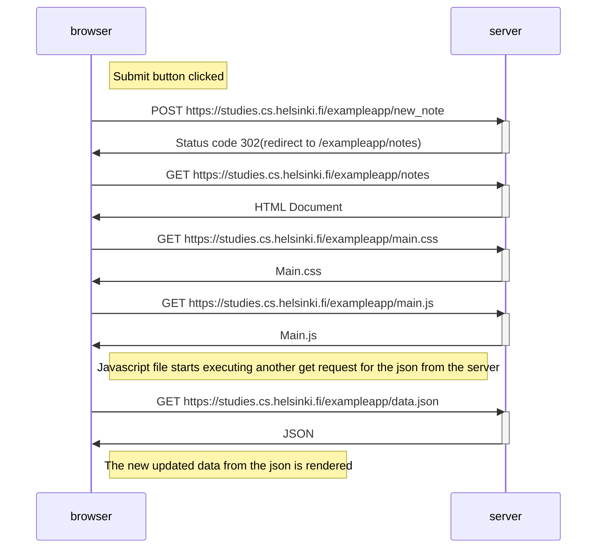

```mermaid
sequenceDiagram
    participant browser
    participant server

    note right of browser: Submit button clicked

    browser->>server: POST https://studies.cs.helsinki.fi/exampleapp/new_note
    activate server
    server->>browser: Status code 302(redirect to /exampleapp/notes)

    deactivate server

    browser->>server: GET https://studies.cs.helsinki.fi/exampleapp/notes
    activate server
    server->>browser: HTML Document
    deactivate server

    browser->>server: GET https://studies.cs.helsinki.fi/exampleapp/main.css
    activate server
    server->>browser: Main.css
    deactivate server

    browser->>server: GET https://studies.cs.helsinki.fi/exampleapp/main.js
    activate server
    server->>browser: Main.js
    deactivate server

    note right of browser: Javascript file starts executing another get request for the json from the server 

    browser->>server: GET https://studies.cs.helsinki.fi/exampleapp/data.json
    activate server
    server->>browser: JSON
    deactivate server

    note right of browser: The new updated data from the json is rendered
```