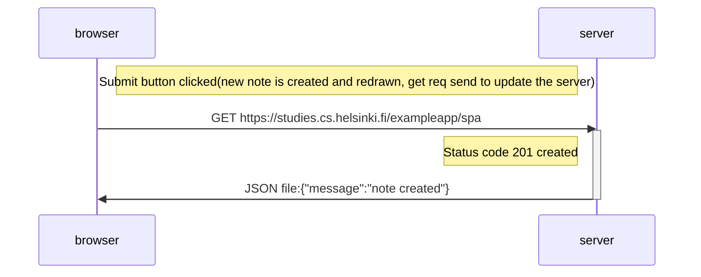

```mermaid
sequenceDiagram
    participant browser
    participant server

    note right of browser: Submit button clicked(new note is created and redrawn, get req send to update the server)

    browser->>server: GET https://studies.cs.helsinki.fi/exampleapp/spa
    activate server

    note left of server: Status code 201 created
    server->>browser: JSON file:{"message":"note created"}
    deactivate server
```